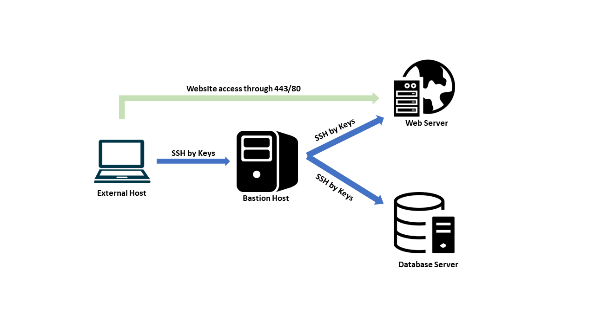
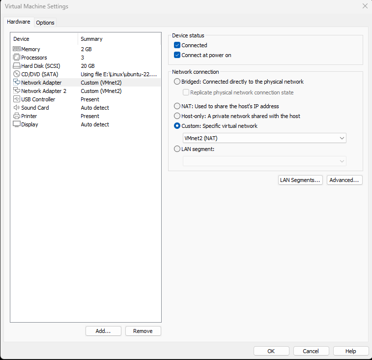
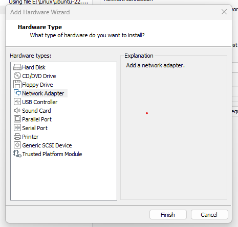
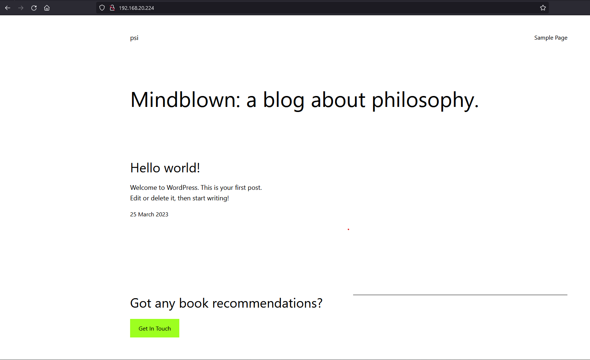

## Proyecto Final - OS Security I

Universidad Galileo

Rodnal Tellez - 11002972

Douglas Figueroa - 13000530
___

**Índice**
- [Proyecto Final - OS Security I](#proyecto-final---os-security-i)
- [**Introducción**](#introducción)
- [**Objetivo**](#objetivo)
- [**Alcance Del Proyecto**](#alcance-del-proyecto)
- [**Audiencia**](#audiencia)
- [**Definición De La Solución Propuesta**](#definición-de-la-solución-propuesta)
- [**Requerimientos**](#requerimientos)
- [**Diagrama De Infraestructura**](#diagrama-de-infraestructura)
- [**Detalle De Instalación**](#detalle-de-instalación)
  - [Creación de Equipos](#creación-de-equipos)
    - [Bastion](#bastion)
    - [Servidor Web - Wordpress](#servidor-web---wordpress)
  - [Instalación Wordpress](#instalación-wordpress)
    - [Servidor Base de Datos - MySQL](#servidor-base-de-datos---mysql)
  - [Configuración de diccionario de contraseñas no permitidas](#configuración-de-diccionario-de-contraseñas-no-permitidas)
  - [Creación de grupos](#creación-de-grupos)
  - [Instalación de SSH](#instalación-de-ssh)
  - [Autenticación con SSH llave pública y privada](#autenticación-con-ssh-llave-pública-y-privada)
    - [**Configuracion del ProxyJump (Opcional)**\*](#configuracion-del-proxyjump-opcional)
  - [Deshabilitar autenticación por contraseña](#deshabilitar-autenticación-por-contraseña)
  - [Elevar privilegios para usuarios `adm01` y `adm02`](#elevar-privilegios-para-usuarios-adm01-y-adm02)
  - [Configuración de acceso a servidores por medio de grupos](#configuración-de-acceso-a-servidores-por-medio-de-grupos)
  - [Configuración de ejecución de servicios sin contraseña - `systemctl`](#configuración-de-ejecución-de-servicios-sin-contraseña---systemctl)
  - [Configuración de Firewall](#configuración-de-firewall)
- [**Personalización**](#personalización)
- [**Inventario de Equipos**](#inventario-de-equipos)
- [**Inventario de Credenciales Iniciales**](#inventario-de-credenciales-iniciales)
- [**Pruebas Documentadas**](#pruebas-documentadas)
- [**Referencias**](#referencias)
- [**Anexos**](#anexos)


## **Introducción**

___
## **Objetivo**

Crear una infraestructura segura de equipos que estarán ejecutando servicios web y de base de datos, que los servicios puedan ser accedidos únicamente por los grupos y usuarios permitidos y bloquear el acceso a cualquier otro usuario.

Poner en práctica el uso de herramientas y configuraciones en el sistema operativo para controlar los accesos y bloqueos, tales como:

* Ubuntu Server 22.04
* SSH
* Firewal UFW
* Libpam Crack-lib
* MySQL
* Wordpress
* Systemctl

___
## **Alcance Del Proyecto**


___
## **Audiencia**

___
## **Definición De La Solución Propuesta**
Se necesita una infraestructura de 3 equipos con ubuntu server 22.04 para alojar los servicios requeridos y una máquina adicional para gestionar el acceso a dichos servicios.
* **Cliente Bastion**: este equipo será el puente seguro para conectarse al servidor web y servidor de base de datos.
* **Servidor Web**: servidor utilizado para alojar los servicios web.
* **Servidor Base de Datos**: servidor utilizado para alojar los servicios de base de datos.
* **Cliente Externo**: Para nuestro escenario, creamos una cuarta máquina virtual la cuál será utilizada como un cliente externo para acceder a Bastion y las pruebas necesarias de funcionalidad.

___
## **Requerimientos**

Se requiere para la creación de las máquinas virtuales un virtualizador, en este caso podemos utilizar VMWare Workstation.
* Link de descarga: https://www.vmware.com/latam/products/workstation-pro/workstation-pro-evaluation.html

Se requiere para instalar el sistema operativo una imagen de un Ubuntu Server 22.04
* Link de descarga: https://ubuntu.com/download/server

Mínimo hardware disponible para cada equipo, siendo 4 en total las que serán creadas:
* 1GB de RAM
* 1 CPU
* 20GB espacio en disco

___
## **Diagrama De Infraestructura**

___
## **Detalle De Instalación**

### Creación de Equipos

Para crear los equipos se debe utilizar una imagen de Ubuntu Server 22.04 o actual versión.
Aquí: https://ubuntu.com/download/server

Para su instalación puede seguir este tutorial: https://www.youtube.com/watch?v=lbYzBsQvPrc

Se deben crear los siguientes 4 equipos con los nombres de servidor, usuario y contraseña descritos en la sección [**Inventario de Credenciales Iniciales**](#inventario-de-credenciales-iniciales).

* Cliente Externo
* Bastion
* Web
* Base de Datos

Para los equipos `Bastion` y `Web` debe crearse un segundo adaptador de red durante la creación del equipo. Cuando se configure los recursos de la máquina.

Clic botón Add.



Seleccionar Network Adapter.



Unav vez creados los equipos, proceder a realizar la siguiente configuración por cada equipo.

#### Bastion

Ingresamos al equipo con el usuario `psiadmin`.

Editar el archivo `00-installer-config.yaml` para configurar la ip estática 10.0.0.1 en la interfaz `ens33`, el valor dhcp4 cambiará a `no`.
**Los archivos .yaml deben estar con la identación correcta de 2 espacios y 1 espacio luego del guión.**
```
sudo nano /etc/netplan/00-installer-config.yaml

# Editar archivo
dhcp4: no
addresses:
    - 10.0.0.1/29
```
Guardar cambios con Ctrl+O y salir con Ctrl+X. Aplicamos los cambios.
```
sudo netplan apply
```

#### Servidor Web - Wordpress

Editar el archivo `00-installer-config.yaml` para configurar la ip estática 10.0.0.2 en la interfaz `ens33`, el valor dhcp4 cambiará a `no`.
**Los archivos .yaml deben estar con la identación correcta de 2 espacios y 1 espacio luego del guión.**
```
sudo nano /etc/netplan/00-installer-config.yaml

# Editar archivo
dhcp4: no
addresses:
    - 10.0.0.2/29
```
Guardar cambios con Ctrl+O y salir con Ctrl+X. Aplicamos los cambios.
```
sudo netplan apply
```
___

### Instalación Wordpress

Ingresar al equipo servidor web con el usuario `psiadmin`.

**Instalación de dependencias**
```
sudo apt update
sudo apt install apache2 \
                 ghostscript \
                 libapache2-mod-php \
                 php \
                 php-bcmath \
                 php-curl \
                 php-imagick \
                 php-intl \
                 php-json \
                 php-mbstring \
                 php-mysql \
                 php-xml \
                 php-zip
```

**Instalación de Wordpress**

Creamos un directorio para el sitio web y asignamos el usuario.
```
sudo mkdir -p /srv/www
sudo chown www-data: /srv/www
curl https://wordpress.org/latest.tar.gz | sudo -u www-data tar zx -C /srv/www
```
Copiamos archivo de configuración.
```
sudo -u www-data cp /srv/www/wordpress/wp-config-sample.php /srv/www/wordpress/wp-config.php
```
Actualizamos variables dentro del archivo de configuración `wp-config.php`
```
sudo -u www-data sed -i 's/database_name_here/wordpress/' /srv/www/wordpress/wp-config.php
sudo -u www-data sed -i 's/username_here/wordpress/' /srv/www/wordpress/wp-config.php
sudo -u www-data sed -i 's/password_here/psipassword/' /srv/www/wordpress/wp-config.php
sudo -u www-data sed -i 's/localhost/10.0.0.3/' /srv/www/wordpress/wp-config.php
```
Entramos al archivo de configuración `wp-config.php` y buscamos la sección `#Authentication unique keys and salts` para cambiar el valor de las siguientes llaves:
```
sudo nano /srv/www/wordpress/wp-config.php
```
Editar las siguientes líneas
```
define('AUTH_KEY',         'cFPqv~_(t|S;I+>j<nD(5N,uWR% :|Rx$b1UlbjfALi_KTs;X|WWQMhHb^^vi{9M');
define('SECURE_AUTH_KEY',  '3~IuwH?&rpF-%T4U80KR=^p*2hrE|BTZY@!{SSxLz-2)lV2va][U +<lR9G6lT3*');
define('LOGGED_IN_KEY',    'n-RN^0:e)n+`O _X6:bk[In_y )>:G$@+YUb[`VVk>-q6 !.7zobxwjlu~uQhN2#');
define('NONCE_KEY',        'Y*bZWEs0`xJ~3%qnzB)<7i~^dAb1I90kSAXZb]cOd9t)VQ;YD|x3ht5Zu0_tvqoo');
define('AUTH_SALT',        'h|:G%(u<Fp) gy q:XJx (b^EXc7w#Bf@7TZ7+bVq8y|ZGt$vX7DHEV:!@mnH?Cm');
define('SECURE_AUTH_SALT', '&F.5qfH3[!x-{2?~Vk&!>V eWWZGVp4.s`RPsVOF|f=cKnz|}L[<$_H!2+uSh/Mx');
define('LOGGED_IN_SALT',   'Z*q %}Wcc<itlXoukrPJ9,mdW|H9F|01(D1K}F(RMV}Yd#w}diMx%5< Z/#}Xl2C');
define('NONCE_SALT',       'IBv&z&_u.pYulVm3Z<3HScQhk4_%<fdlA!MO{.d2_,]ClW-7;s!=BM~M}rrK,mT4');
```
Guardar cambios con Ctrl+O y salir con Ctrl+X.

**Instalación Apache**

Realizamos la configuración de apache, creamos el archivo `wordpress.conf`
```
sudo touch /etc/apache2/sites-available/wordpress.conf
```
Entramos al archivo y agregamos el siguiente contenido.
```
sudo nano /etc/apache2/sites-available/wordpress.conf

# Contenido
<VirtualHost *:80>
    DocumentRoot /srv/www/wordpress
    <Directory /srv/www/wordpress>
        Options FollowSymLinks
        AllowOverride Limit Options FileInfo
        DirectoryIndex index.php
        Require all granted
    </Directory>
    <Directory /srv/www/wordpress/wp-content>
        Options FollowSymLinks
        Require all granted
    </Directory>
</VirtualHost>
```
Finalizamos la instalación y se recarga el servicio
```
sudo a2ensite wordpress
sudo a2enmod rewrite
sudo a2dissite 000-default
sudo systemctl reload apache2
```
___

**Instalación de MySQL**

Ingresar al equipo servidor web con el usuario `psiadmin`.

Instalamos MySQL
```
sudo apt install mysql-server
```
Configuramos la ip estática del servidor.

#### Servidor Base de Datos - MySQL

Editar el archivo `00-installer-config.yaml` para configurar la ip estática 10.0.0.3 en la interfaz `ens33`, el valor dhcp4 cambiará a `no`.
**Los archivos .yaml deben estar con la identación correcta de 2 espacios y 1 espacio luego del guión.**
```
sudo nano /etc/netplan/00-installer-config.yaml

# Editar archivo
dhcp4: no
addresses:
    - 10.0.0.3/29
```
Guardar cambios con Ctrl+O y salir con Ctrl+X. Aplicamos los cambios.
```
sudo netplan apply
```
Continuamos con la configuración de la base de datos. Ingresamos con el usuario root para crear la base de datos.
```
sudo mysql -u root

# Dentro de la base de datos
CREATE DATABASE wordpress;
CREATE USER 'wordpress'@'%' IDENTIFIED WITH mysql_native_password BY 'psipassword';
GRANT ALL PRIVILEGES ON wordpress.* TO 'wordpress'@'%';
FLUSH PRIVILEGES;
```

Verificamos los privilegios otorgados con el comando
```
SHOW GRANTS FOR 'wordpress'@'%';
exit
```

El usuario wordpress deberia tener permisos de uso junto con los privilegios en la base de datos wordpress

Entramos al archivo de configuración `mysqld.cnf`
```
sudo nano /etc/mysql/mysql.conf.d/mysqld.cnf
```
Comentaremos la línea `bind-address = 127.0.0.1`
```
#bind-address = 127.0.0.1
```
Reiniciamos el servicio
```
sudo systemctl restart mysql
```

___

### Configuración de diccionario de contraseñas no permitidas

Utilizando el usuario `psiadmin`.

En el equipo Cliente, Bastion, Servidor Web y Servidor de Base de Datos.

Ejecutar el siguiente comando para instalar el módulo `libpam-cracklib`.
```
sudo apt-get update
sudo apt-get install libpam-cracklib
```

Debemos crear el documento que contendrá el listado de contraseña.

```
sudo nano commonpasswords
```
Agregamos al archivo
```
root
Qwerty
Qwertyuiop
Abc123
654321
123321
Password
P@ssw0rd
```
Guardar cambios con Ctrl+O y salir con Ctrl+X

Verificamos que el archivo fue creado
```
cat commonpasswords
```
Agregamos el archivo al diccionario de palabras
```
sudo create-cracklib-dict commonpasswords
```
Podemos verificar su funcionamiento ejecutando
```
echo "Qwertyuiop" | cracklib-check
```
___

### Creación de grupos

Utilizando el usuario `psiadmin` crear los siguientes grupos y usuarios en cada equipo.

Se tendrán los siguientes grupos:
* `webmasters`: usuarios para administrar el servidor web
* `databaseadmins`: usuarios para administrar el servidor de base de datos
* `administrators`: usuarios con permisos de administrador para entrar al servidor web y base de datos

Los grupos deben ser creados en los 3 servidores y el equuipo cliente externo.

Entrar a los 4 equipos y ejecutar los siguiente comandos
```
sudo groupadd -g 1200 webmasters
sudo adduser -u 1201 web01
sudo adduser -u 1202 web02
sudo usermod -a -G webmasters web01
sudo usermod -a -G webmasters web02

sudo groupadd -g 1300 databaseadmins
sudo adduser -u 1301 dba01
sudo adduser -u 1302 dba02
sudo usermod -a -G databaseadmins dba01
sudo usermod -a -G databaseadmins dba02

sudo groupadd -g 1400 administrators
sudo adduser -u 1401 adm01
sudo adduser -u 1402 adm02
sudo usermod -a -G administrators adm01
sudo usermod -a -G administrators adm02
```
___

Para automatizar la creación de estos grupos y usuarios, puede ejecutar un script, para esto es necesario instalar git.
```
sudo apt-get update
sudo apt-get install git
```

Luego de instalado el servicio, clonar el siguiente repositorio
```
git clone https://github.com/stellez/psi-os-security-project-2.git
```
Entrar a la carpeta de scripts, darle permisos y ejecutar el script `crear-usuarios.sh`
```
cd psi-os-security-project-2
cd scripts
sudo chmod 760 crear-usuarios.sh
sudo ./crear-usuarios.sh
```

### Instalación de SSH

Utilizando el usuario `psiadmin`.

Para que los usuarios puedan autenticarse con llave pública y privada debe realizarse la siguiente configuración:

Si el equipo `cliente externo` no cuenta con el cliente de SSH, instalarlo de la siguiente forma.
```
sudo apt-get update
sudo apt-get upgrade
sudo apt-get install openssh-client
```

Para cada servidor, bastion, base de datos y web, instalar OpenSHH server.
```
sudo apt-get update
sudo apt-get upgrade
sudo apt-get install openssh-server
```
Habilitar e iniciar el servicio
```
sudo systemctl enable ssh
sudo systemctl start ssh
```
Verificamos que el servicio se encuentre activo
```
sudo systemctl status ssh
```
___

### Autenticación con SSH llave pública y privada

El servidor Bastion funciona como un proxy o bien se le conoce como servidor de salto, en el cual es necesario hacer login para acceder a los servicios en la red privada, la forma de hacer login es por medio del protocolo criptografico SSH.

Dado que se requiere facilitar el acceso a los servidores es necesario generar una llave publica y privada para cada usuario y copiarla al servidor Bastion para asi garantizar la autenticidad del usuario.

Una vez instalados los servicios SSH, procedemos a generar la llavé pública y privada para la autenticación de los usuarios `adm01`,`adm02`,`web01`,`web02`,`dba01`,`dba02`.

Vamos al equipo Cliente Externo y generamos la llave indicando que será generada con 4096 bits
```
ssh-keygen -b 4096
```
Nos solicitará una frase, la frase debe ser: `Me encanta Linux`

Ahora que tenemos la llave generada, la debemos copiar al equipo Bastion con la ip pública que nos haya asignado la red.
```
ssh-copy-id [usuario]@[ip-pública-bastion]
```
Entramos al equipo Bastion el cual que nos solicitará la frase configurada anteriormente.
```
ssh [usuario]]@[ip-pública-bastion]
```
Al escribir la frase correcta tendremos acceso al servidor, dado que tambien se requiere facilitar el acceso al los servidores internos garantizando la autenticidad del cliente se debe copiar la llave pública hacia los servidores internos, se debe tener en cuenta el rol del usuario al copiar la llave pública ya que los administradores pueden acceder a ambos servicios mientras que los usuarios web solo pueden acceder al servicio web, de la misma manera los DBAs tienen acceso únicamente al servicio de base de datos.
```
scp -r .ssh/ [ususario]@[ip-privada-servicio]:~ 
```
Despues de copiar la llave pública hacemos logout en el cliente y podemos verificar la conexion hacia los servidores internos
```
ssh -J [ip-pública-bastion] [ip-privada-servicio]
```
La frase secreta configurada anteriormente debera ser ingresada dos veces de forma exitosa ya que la primera vez se hace un loguin en Bastion y la segunda vez hacia el servidor deseado.

#### **Configuracion del ProxyJump (Opcional)***

Se puede configurar el salto en el servicio de SSH para que sea transparente al usuario.

Por cada usuario debemos crear el archivo de configuracion en su carpeta respectiva de SSH.
```
touch ~/.ssh/config
```
Al crear el archivo lo editamos con nuestro editor de preferencia
```
sudo nano ~/.ssh/config
```
Agregar en el archivo, por ejemplo `ip-privada-servicio=10.0.0.2`, `ip-pública-bation=192.168.20.222`.
```
Host [ip-privada-servicio]
  ProxyJump [ip-pública-bastion]
```
Al guardar la configuracion podemos realizar una conexion por SSH, de la misma manera la frase se debera ingresar dos veces pero facilita no recordar la IP publica del servicio Bastion
```
ssh [ip-privada-servicio]
```
___

### Deshabilitar autenticación por contraseña

Utilizando el usuario `psiadmin`.

Una vez tengamos los servicios de SSH instalados en Bastion, Web Server y Base de Datos, deshabilitaremos la autenticación por medio de contraseña.

En cada servidor deben realizarse las siguientes tareas.

Entrar al archivo sshd_config
```
sudo nano /etc/ssh/sshd_config
```
Buscar la línea comentada
```
#PasswordAuthentication yes
```

Descomentar la línea y cambiar el valor a `no`
```
PasswordAuthentication no
```
Guardar cambios con Ctrl+O y salir con Ctrl+X

Reiniciarmos el servicio de SSH
```
sudo systemctl restart ssh
```
___

### Elevar privilegios para usuarios `adm01` y `adm02`

Para poder ejecutar permisos sudo para los usuarios del grupo `administrators`, debe realizarse la configuración en el archivo `/etc/sudoers`.

Ingresar al servidor web con el usuario `psiadmin`, abrir el archivo
```
sudo nano /etc/sudoers
```
En la sección `# Members of the admin group may gain root privileges` agregar la siguiente línea
```
%administrators ALL=(ALL) ALL
```
Guardar cambios con Ctrl+O y salir con Ctrl+X.

Ingresar al servidor de base de datos con el usuario `psiadmin`, abrir el archivo
```
sudo nano /etc/sudoers
```
En la sección `# Members of the admin group may gain root privileges` agregar la siguiente línea
```
%administrators ALL=(ALL) ALL
```
Guardar cambios con Ctrl+O y salir con Ctrl+X

___

### Configuración de acceso a servidores por medio de grupos

Los usuarios del grupo `webmasters` y `administrators` son los únicos con acceso al servidor web. Configurar en el servidor web con el usuario `psiadmin`.

Entrar al archivo de configuración `/etc/ssh/sshd_config`
```
sudo nano /etc/ssh/sshd_config
```
Al final del archivo agregar
```
AllowGroups     webmasters administrators
DenyGroups      databaseadmins
```
Guardar cambios con Ctrl+O y salir con Ctrl+X

Reiniciamos el servicio de ssh
```
sudo systemctl restart sshd
```

Los usuarios del grupo `databaseadmins` y `administrators` son los únicos con acceso al servidor de base de datos. Configurar en el servidor de base de datos con el usuario `psiadmin`.

Entrar al archivo de configuración `/etc/ssh/sshd_config`
```
sudo nano /etc/ssh/sshd_config
```
Al final del archivo agregar
```
AllowGroups     databaseadmins administrators
DenyGroups      webmasters
```
Guardar cambios con Ctrl+O y salir con Ctrl+X

Reiniciamos el servicio de ssh
```
sudo systemctl restart sshd
```

Se permite el acceso al equipo Bastion para todos los grupos, pues cada uno realizará un salto para llegar a su servidor de destino. Utilizando el usuario `psiadmin`.

Entrar al archivo de configuración `/etc/ssh/sshd_config`
```
sudo nano /etc/ssh/sshd_config
```
Al final del archivo agregar
```
AllowGroups     administrators databaseadmins webmasters
```
Guardar cambios con Ctrl+O y salir con Ctrl+X

Reiniciamos el servicio de ssh
```
sudo systemctl restart sshd
```
___

### Configuración de ejecución de servicios sin contraseña - `systemctl`

Las acciones que se pueden ejecutar sobre un servicio con `systemctl`
```
sudo systemctl enable {service-name}
sudo systemctl start {service-name}
sudo systemctl status {service-name}
sudo systemctl stop {service-name}
```

En el servidor web.

A continuación configurar los permisos sobre el servicio Apache para el grupo `webmasters` y `administrators`
Entrar a editar el archivo `/etc/sudoers`.
```
sudo nano /etc/sudoers
```
Navegar hasta encontrar el comentario `#Allow members of group sudo to execute any command`

Crear una variable para almacenar las acciones que podrán ejecutarse sobre el servicio Apache.
```
Cmnd_Alias APACHE_SERVICE = /usr/bin/systemctl start apache2,/usr/bin/systemctl restart apache2,/usr/bin/systemctl stop apache2,/usr/bin/systemctl status apache2
```
En la siguiente línea, agregar el grupo de usuarios que podrá ejecutar las acciones configuradas.
```
%webmasters     ALL=(ALL) NOPASSWD:APACHE_SERVICE
%administrators ALL=(ALL) NOPASSWD:APACHE_SERVICE
```

En el servidor de base de datos.

A continuación configurar los permisos sobre el servicio MySQL para el grupo `databaseadmins` y `administrators`
Entrar a editar el archivo `/etc/sudoers`.
```
sudo nano /etc/sudoers
```
Navegar hasta encontrar el comentario `#Allow members of group sudo to execute any command`

Crear una variable para almacenar las acciones que podrán ejecutarse sobre el servicio Apache.
```
Cmnd_Alias MYSQL_SERVICE = /usr/bin/systemctl start mysql,/usr/bin/systemctl restart mysql,/usr/bin/systemctl stop mysql,/usr/bin/systemctl status mysql
```
En la siguiente línea, agregar el grupo de usuarios que podrá ejecutar las acciones configuradas.
```
%databaseadmins ALL=(ALL) NOPASSWD:MYSQL_SERVICE
%administrators ALL=(ALL) NOPASSWD:MYSQL_SERVICE
```
Guardar cambios con Ctrl+O y salir con Ctrl+X

Al estar logueado con un usuario del respectivo grupo y ejecutar la acción al servicio, este no pedirá contraseña.

Por ejemplo para reiniciar el servicio de apache con un usuario del grupo webmasters.
```
sudo systemctl restart apache2
```
___
### Configuración de Firewall

El servicio `ufw` ya se encuentra instalado por defecto en un Ubuntu Server en estado inactivo.

Se aplicarán las reglas para bloquear todas las solicitudes entrantes y permitir las salientes y activaremos el servicio. Esta configuración debe realizarse en el equipo Bastion, servidor Web y Base de Datos utilizando el usuario `psiadmin`.
```
sudo ufw default deny incoming
sudo ufw default allow outgoing

sudo ufw enable
```

En Bastion realizaremos la configuración para que pueda ser accedido únicamente por SSH

Permitimos conexión por SSH en el puerto 22
```
sudo ufw allow 22
```

En el servidor web, permitimos conexión SSH únicamente desde el equipo Bastion.
```
sudo ufw allow from 10.0.0.1 to any port 22
```

En el servidor de base de datos, permitimos conexión SSH únicamente desde el equipo Bastion.
```
sudo ufw allow from 10.0.0.1 to any port 22
```
Permitimos el acceso al servicio de base de datos únicamente desde el servidor web.
```
sudo ufw allow mysql from 10.0.0.2
```

***********
**PENDIENTE ACL**
***********
●	Los usuarios pueden editar los archivos de configuración de su ROL:
○	/etc/mysql o similar para DBs
○	/etc/apache2 o similar para WEB
***********
**PENDIENTE ACL**
***********
___
## **Personalización** 

___
## **Inventario de Equipos**

___
## **Inventario de Credenciales Iniciales**

Retorno a: [Creación de Equipos](#creación-de-equipos)

Detalles para cada servidor.
* Nombre de servidor.
* Nombre de usuario.
* Contraseña.

Cliente Externo
```
servername: ubusclient
usuario: psiadmin
contraseña: PsiOS2023
```
Bastion
```
servername: ubusbastion
usuario: psiadmin
contraseña: PsiOS2023bastion
```
Web
```
servername: ubusweb
usuario: psiadmin
contraseña: PsiOS2023web
```
Base de Datos
```
servername: ubusdb
usuario: psiadmin
contraseña: PsiOS2023db
```

Usuarios y grupos

Grupo administrators 
```
usuario: adm01
contraseña: psi-adm-01

usuario: adm02
contraseña: psi-adm-02
```

Grupo webmasters 
```
usuario: web01
contraseña: psi-web-01

usuario: web02
contraseña: psi-web-02
```

Grupo databaseadmins
```
usuario: dba01
contraseña: psi-dba-01

usuario: dba02
contraseña: psi-dba-02
```

___
## **Pruebas Documentadas**

Accceso a servicio Wordpress desde un equipo externo.

___
## **Referencias**

* **Creación de grupos y usuarios**
  * https://ubuntu.com/server/docs/security-users
* **Generación y autenticación SSH llave pública y privada**
  * https://www.digitalocean.com/community/tutorials/how-to-set-up-ssh-keys-on-ubuntu-22-04
* **Instalación módulo libpam-cracklib**
  * https://howtoinstall.co/en/libpam-cracklib
* **Configuración de acceso a equipos por grupos y usuarios** 
  * https://ostechnix.com/allow-deny-ssh-access-particular-user-group-linux/
* **Configuración de ejecución con systemctl sin contraseña** 
  * https://serverfault.com/questions/1057463/grant-a-user-sudo-powers-to-start-stop-etc-a-systemd-service-w-o-sudo-password
* **Configuración de Firewall**
  *  https://www.digitalocean.com/community/tutorials/how-to-set-up-a-firewall-with-ufw-on-ubuntu-22-04
* **Configuración de Firewall desde un host específico**
  * https://ubuntu.com/server/docs/security-firewall
* **¿Qué es un Bastion?**
  * https://www.learningjournal.guru/article/public-cloud-infrastructure/what-is-bastion-host-server/
* **Wordpress** 
    * https://ubuntu.com/tutorials/install-and-configure-wordpress#4-configure-apache-for-wordpress
    * https://www.digitalocean.com/community/tutorials/install-wordpress-on-ubuntu
* **MySQL**
  * https://ubuntu.com/server/docs/databases-mysql
  * https://www.linode.com/docs/guides/installing-and-configuring-mysql-on-ubuntu-2004/
* **Configuración IP estática**
  * https://www.linuxtechi.com/static-ip-address-on-ubuntu-server/
___
## **Anexos**
